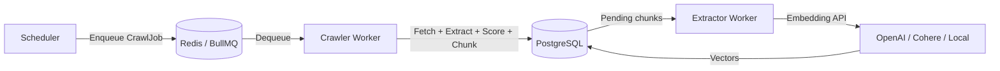
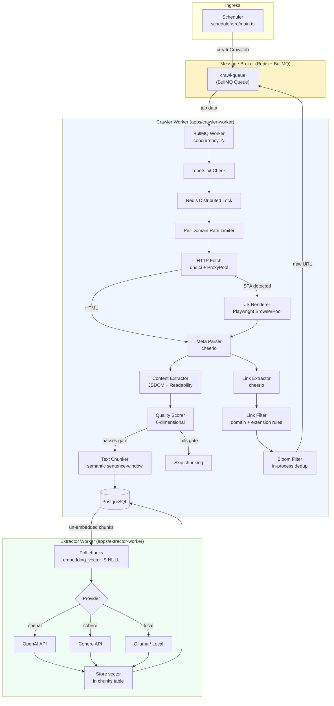
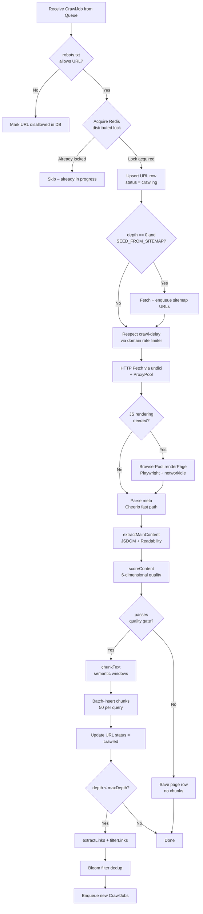
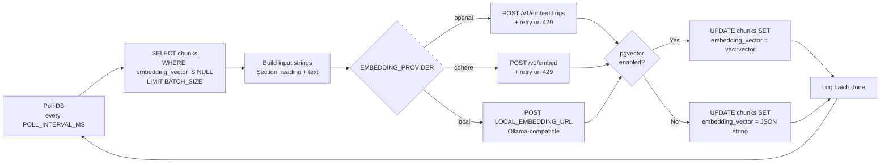
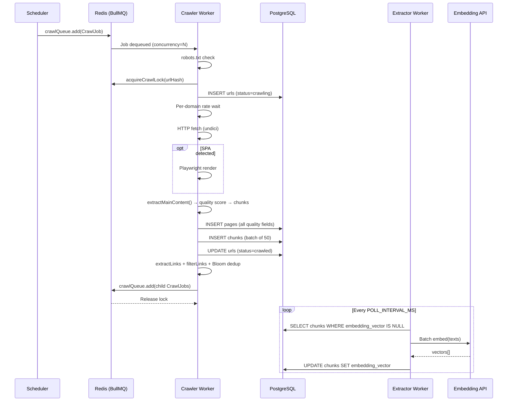
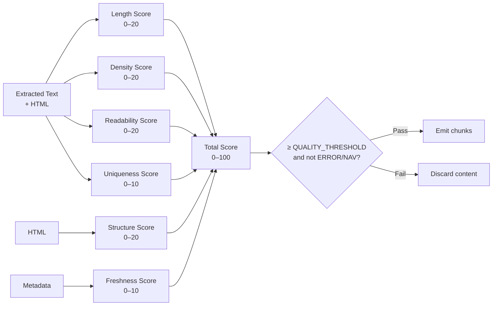
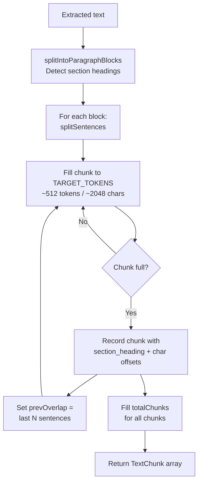
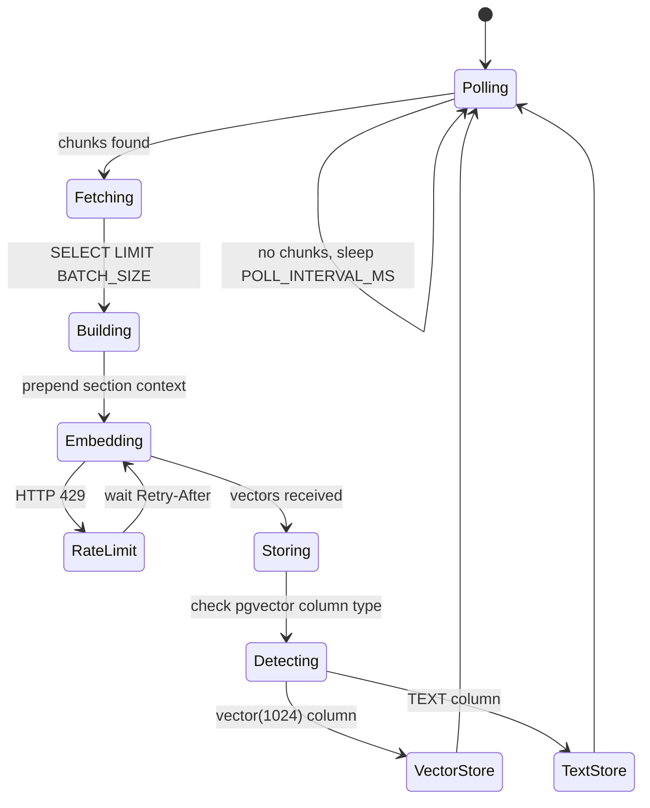
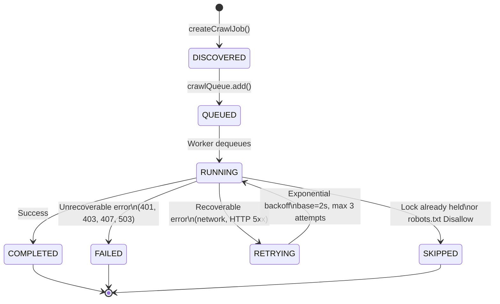

# Web Intelligence Platform

A distributed, AI/RAG-ready web crawling and content intelligence platform built on a Bun-powered TypeScript monorepo. The system orchestrates large-scale web crawling, structured content extraction, quality scoring, and vector embedding generation — designed as a foundation for Retrieval-Augmented Generation (RAG), LLM fine-tuning pipelines, and semantic search applications.

---

## Table of Contents

1. [System Overview](#1-system-overview)
2. [Monorepo Architecture](#2-monorepo-architecture)
3. [System Architecture Diagram](#3-system-architecture-diagram)
4. [Application Services](#4-application-services)
   - 4.1 [Crawler Worker](#41-crawler-worker)
   - 4.2 [Extractor Worker](#42-extractor-worker)
   - 4.3 [Scheduler](#43-scheduler)
5. [Shared Package Library](#5-shared-package-library)
   - 5.1 [@core — Queue, Lock, Rate, URL, Job Primitives](#51-core--queue-lock-rate-url-job-primitives)
   - 5.2 [@crawler — Fetch, Discovery, Extraction](#52-crawler--fetch-discovery-extraction)
   - 5.3 [@storage — PostgreSQL Connection Pool](#53-storage--postgresql-connection-pool)
   - 5.4 [@schemas](#54-schemas)
   - 5.5 [@utils](#55-utils)
6. [Data Pipeline](#6-data-pipeline)
7. [Database Schema](#7-database-schema)
   - 7.1 [Migration 001 — Core Tables](#71-migration-001--core-tables)
   - 7.2 [Migration 002 — AI/RAG-Ready Schema](#72-migration-002--airag-ready-schema)
   - 7.3 [Migration 003 — pgvector Upgrade](#73-migration-003--pgvector-upgrade)
8. [Content Quality Scoring](#8-content-quality-scoring)
9. [Text Chunking Strategy](#9-text-chunking-strategy)
10. [Embedding Pipeline](#10-embedding-pipeline)
11. [Crawl Control Mechanisms](#11-crawl-control-mechanisms)
    - 11.1 [Distributed Deduplication](#111-distributed-deduplication)
    - 11.2 [robots.txt Compliance](#112-robotstxt-compliance)
    - 11.3 [Per-Domain Rate Limiting](#113-per-domain-rate-limiting)
    - 11.4 [JS Rendering Fallback](#114-js-rendering-fallback)
    - 11.5 [Proxy and User-Agent Rotation](#115-proxy-and-user-agent-rotation)
12. [Job Lifecycle](#12-job-lifecycle)
13. [Infrastructure](#13-infrastructure)
14. [Configuration Reference](#14-configuration-reference)
15. [Scripts and Tooling](#15-scripts-and-tooling)
16. [Technology Stack](#16-technology-stack)
17. [Memory Safety Design](#17-memory-safety-design)

---

## 1. System Overview

The Web Intelligence Platform is a multi-process, distributed crawl-and-extract system designed for large-scale, AI-ready content acquisition from the web. Its core responsibilities are:

- **Crawling**: Fetching web pages at configurable depth, with robots.txt compliance, per-domain rate limiting, JS rendering fallback, and proxy/user-agent rotation.
- **Extraction**: Parsing raw HTML into structured content using the Mozilla Readability algorithm, extracting rich metadata (title, author, publication date, OG tags, language).
- **Quality Scoring**: Evaluating every extracted page across six dimensions (length, text density, readability, structure, uniqueness, freshness) to compute a normalized 0–100 quality score.
- **Chunking**: Splitting quality-passing content into semantically coherent, overlapping text chunks suited for vector embedding.
- **Embedding**: Generating dense vector embeddings for all chunks via pluggable providers (OpenAI, Cohere, or a local Ollama-compatible endpoint), then storing them in PostgreSQL with optional pgvector support for approximate nearest-neighbor (ANN) search.



---

## 2. Monorepo Architecture

The project uses a **Bun workspaces monorepo** with two top-level groups:

```
web-intelligence-platform/
├── apps/                        # Runnable service processes
│   ├── crawler-worker/          # Main crawl + extract worker
│   ├── extractor-worker/        # Embedding generation worker
│   └── scheduler/               # Job dispatch entrypoint
├── packages/                    # Shared libraries (internal packages)
│   ├── core/                    # Queue, lock, rate, URL, job primitives
│   ├── crawler/                 # Fetch, discovery, extraction logic
│   ├── schemas/                 # Zod schemas (shared types)
│   ├── storage/                 # PostgreSQL connection pool
│   └── utils/                   # General utility functions
├── infrastructure/
│   └── db/
│       └── migrations/          # Sequential SQL migration files
│           ├── 001_init.sql
│           ├── 002_ai_ready.sql
│           └── 003_pgvector.sql
├── scripts/
│   ├── migrate.ts               # Migration runner
│   ├── seed-job.ts              # CLI to enqueue a seed URL
│   └── load-test.ts             # Throughput benchmarking harness
├── index.ts                     # Platform initialization + Redis health check
├── package.json                 # Workspace root with npm scripts
├── tsconfig.json                # Shared TypeScript config with path aliases
└── .env.example                 # Environment variable reference
```

Each app and package has its own `package.json` and `tsconfig.json`. TypeScript path aliases defined at the workspace root (`@core`, `@crawler`, `@storage`, `@schemas`, `@utils`) resolve each package without `../../../` traversal.

---

## 3. System Architecture Diagram



---

## 4. Application Services

### 4.1 Crawler Worker

**Location**: `apps/crawler-worker/src/worker.ts`

The crawler worker is the central processing unit of the platform. It consumes `CrawlJob` messages from the BullMQ `crawl-queue` and executes a multi-stage pipeline for each URL.

#### Processing Pipeline per Job



#### Key Configuration

| Env Variable | Default | Description |
|---|---|---|
| `CONCURRENCY` | `10` | Number of jobs processed simultaneously per process |
| `JS_RENDER_ENABLED` | `true` | Enable Playwright fallback for SPA pages |
| `JS_BROWSER_POOL_SIZE` | `2` | Number of Chromium instances in the browser pool |
| `SEED_FROM_SITEMAP` | `true` | Auto-discover URLs from `sitemap.xml` on depth-0 jobs |
| `QUALITY_THRESHOLD` | `25` | Minimum quality score (0–100) to emit chunks |

#### Graceful Shutdown

On `SIGTERM` or `SIGINT`, the worker drains active jobs, destroys proxy agent handles, closes all Playwright browser instances, and terminates the PostgreSQL connection pool — preventing file descriptor and memory leaks in containerized deployments.

---

### 4.2 Extractor Worker

**Location**: `apps/extractor-worker/index.ts`

The extractor worker runs as an independent long-polling process. It queries PostgreSQL for chunks with `embedding_vector IS NULL AND embedding_model IS NULL`, generates embeddings in batches, and writes the resulting vectors back to the `chunks` table.

#### Embedding Pipeline



The worker auto-detects whether the `embedding_vector` column has been upgraded to `vector(1024)` type (via migration 003) or still stores values as `TEXT`. It caches this detection result for the lifetime of the process. Rate limit responses (HTTP 429) trigger an exponential backoff retry with the delay sourced from the `Retry-After` header.

---

### 4.3 Scheduler

**Location**: `apps/scheduler/`

The scheduler is the job ingestion entrypoint. It normalizes a seed URL, generates a SHA-256 URL fingerprint, constructs a validated `CrawlJob` object, and dispatches it to the BullMQ queue. The `seed-job.ts` CLI script wraps this logic for command-line use.

---

## 5. Shared Package Library

### 5.1 `@core` — Queue, Lock, Rate, URL, Job Primitives

**Location**: `packages/core/src/`

#### Queue (`core/src/queue/`)

- `connection.ts` — Provides `createRedisConnection()` (factory for fresh ioredis instances) and `redis` (shared singleton for non-BullMQ operations). BullMQ requires separate connections for Queue, Worker, and QueueEvents to avoid blocking mode conflicts.
- `crawl-queue.ts` — Exports the singleton `crawlQueue` (`Queue<CrawlJob>`) with exponential backoff retry (3 attempts, 2s base delay), bounded completion/failure job retention.

#### Lock (`core/src/lock/`)

- `crawl-lock.ts` — Implements a distributed crawl lock using Redis `SET NX EX`. Each URL hash acquires an exclusive lock for 300 seconds. If another worker has already claimed the URL, `acquireCrawlLock()` returns `false` and the job is skipped without re-processing.

#### Rate Limiting (`core/src/rate/`)

- `domain-rate.ts` — Per-domain rate limiter using Redis timestamps. Enforces a minimum 1000ms gap between requests to the same domain. When `robots.txt` specifies a `Crawl-delay`, that value is used instead (floor: 1000ms). Uses an atomic `SET ... EX` to coordinate across multiple worker processes.

#### URL Utilities (`core/src/url/`)

- `normalize.ts` — Strips tracking parameters (`utm_*`, `fbclid`, `gclid`, `ref`, etc.), lowercases hostname, removes fragment, sorts remaining query params, and strips trailing slashes to produce a canonical URL.
- `fingerprint.ts` — Computes a SHA-256 hash of the normalized URL string using the Web Crypto API. Used as the `url_hash` primary key in the `urls` table.
- `bloom.ts` — Initializes a 1-million-entry Bloom filter (1% false positive rate) per worker process. The `seenUrl()` function provides O(1) in-process deduplication before issuing Redis/DB round-trips.
- `classify.ts` — Classifies URLs into `detail`, `listing`, `article`, or `unknown` based on URL pattern matching.

#### Job (`core/src/job/`)

- `crawl-job.ts` — Zod schema defining `CrawlJob`: `jobId`, `url`, `urlHash`, `domain`, `sessionId`, `depth`, `maxDepth`, `priority`, `retryCount`, `maxRetries`, `state`, `createdAt`, `updatedAt`.
- `job-state.ts` — Enum `CrawlJobState`: `DISCOVERED → QUEUED → RUNNING → COMPLETED | FAILED | RETRYING | SKIPPED`.
- `create-job.ts` — Factory function that parses and validates a new `CrawlJob` via Zod, initializing defaults.

### 5.2 `@crawler` — Fetch, Discovery, Extraction

**Location**: `packages/crawler/src/`

#### Fetch (`crawler/src/fetch/`)

- `fetch-page.ts` — HTTP fetcher using `undici`. Enforces a 30-second hard timeout, a 5 MB body size cap (streams with size guard), filters non-HTML content types, and integrates `ProxyPool` for header and proxy selection. Returns `FetchResult` including status code, resolved URL, HTML body, and proxy identifier.
- `proxy-pool.ts` — `ProxyPool` class manages a weighted round-robin rotation over configured proxies and a bank of 7 real-browser User-Agent strings. Proxies are marked unhealthy after 3 consecutive failures and auto-recover after a 5-minute TTL. Exposes `nextHeaders()` for full HTTP header sets mimicking browser traffic.
- `js-renderer.ts` — `BrowserPool` manages N Playwright Chromium instances. Each render spawns a fresh browser context and page (no state leakage), blocks image/font/media resources (~40% memory reduction), waits for `networkidle` plus a body-length heuristic, then extracts `page.content()`. The `needsJsRendering()` heuristic detects SPAs by empty root divs, Docsify signatures, hash-routes, or minimal text content.
- `agent.ts` — Shared `undici.Agent` for keep-alive HTTP connection pooling (used as fallback when no proxy is configured).

#### Discovery (`crawler/src/discovery/`)

- `extract-links.ts` — Extracts all crawlable `<a href>` links from HTML using Cheerio. Handles SPA hash-routes (`/#/section`) by normalizing the hash path and stripping intra-hash query params. Also scrapes Docsify sidebar nav links and inline script hash-route patterns.
- `filter-links.ts` — Filters extracted links to same-domain HTTP/HTTPS URLs. Drops non-HTML extensions (`.pdf`, `.css`, `.js`, `.png`, etc.), authentication/account paths, and meaningless fragment anchors. Retains SPA hash-routes (`#/path`).
- `parse-page.ts` — Fast Cheerio-based metadata extraction (title, description, h1, body text) without full JSDOM instantiation, used for logging and basic meta population.
- `robots.ts` — `RobotsManager` fetches and parses `robots.txt` per domain (in-memory LRU cache, 500 entries, 1-hour TTL). Respects `User-agent: *` and bot-targeted blocks, `Disallow`/`Allow` directives (glob patterns), and `Crawl-delay`. `fetchSitemapUrls()` is an async generator that streams `<loc>` entries from sitemap and sitemap-index files (up to 2 levels of nesting, 2MB fetch cap).

#### Extraction (`crawler/src/extraction/`)

- `content.ts` — `extractMainContent()` instantiates JSDOM (`runScripts: "outside-only"` for security), extracts structured metadata via `extractMeta()` (OG tags, schema.org dates, author), runs Mozilla Readability to isolate the main article text, invokes quality scoring, and conditionally chunks the content. JSDOM's `window.close()` is called in a `finally` block to release the heap.
- `quality.ts` — See [Section 8](#8-content-quality-scoring).
- `chunker.ts` — See [Section 9](#9-text-chunking-strategy).

### 5.3 `@storage` — PostgreSQL Connection Pool

**Location**: `packages/storage/`

Exports a singleton `db` (using the `postgres` npm package) configured with `max: 10` connections, `idle_timeout: 30s`, and `connect_timeout: 10s`. Immediately validates the connection on module load and surfaces errors to stderr. The `src/db.ts` re-export ensures both `@storage/db` and `@storage` alias paths resolve to the same pool instance.

### 5.4 `@schemas`

**Location**: `packages/schemas/`

Intended for shared Zod schemas accessible across apps and packages without circular imports.

### 5.5 `@utils`

**Location**: `packages/utils/`

General-purpose utility functions shared across packages.

---

## 6. Data Pipeline



---

## 7. Database Schema

### 7.1 Migration 001 — Core Tables

```sql
-- URL state tracking
urls (
  id SERIAL PRIMARY KEY,
  url TEXT UNIQUE,
  url_hash TEXT UNIQUE,   -- SHA-256 of normalized URL
  domain TEXT,
  depth INT DEFAULT 0,
  status TEXT DEFAULT 'pending',  -- pending|crawling|crawled|failed|disallowed
  discovered_at TIMESTAMP,
  last_crawled_at TIMESTAMP
)

-- Page content (basic)
pages (
  id SERIAL PRIMARY KEY,
  url_id INT → urls(id) CASCADE,
  status_code INT,
  title TEXT, description TEXT, h1 TEXT,
  fetched_at TIMESTAMP
)

-- Link graph
links (
  from_url_id INT → urls(id),
  to_url_id INT → urls(id),
  discovered_at TIMESTAMP,
  PRIMARY KEY (from_url_id, to_url_id)
)
```

### 7.2 Migration 002 — AI/RAG-Ready Schema

Migration 002 is additive and idempotent (uses `ADD COLUMN IF NOT EXISTS` and `CREATE TABLE IF NOT EXISTS`). It extends the base schema with:

**pages table additions**:

| Column | Type | Description |
|---|---|---|
| `content` | TEXT | Full extracted article text (from Readability) |
| `excerpt` | TEXT | Short summary (from Readability) |
| `author` | TEXT | From `meta[name=author]` or schema.org |
| `word_count` | INT | Total word count of extracted content |
| `reading_time` | INT | Estimated reading time in minutes (÷200 wpm) |
| `lang` | TEXT | `<html lang>` attribute |
| `quality_score` | INT | Composite 0–100 quality score |
| `quality_length_score` | INT | Length sub-score (0–20) |
| `quality_density_score` | INT | Text density sub-score (0–20) |
| `quality_readability_score` | INT | Readability sub-score (0–20) |
| `quality_structure_score` | INT | Structure sub-score (0–20) |
| `quality_uniqueness_score` | INT | Uniqueness sub-score (0–10) |
| `quality_freshness_score` | INT | Freshness sub-score (0–10) |
| `content_type` | TEXT | `article\|product\|navigation\|error\|thin\|rich\|docs` |
| `quality_flags` | TEXT[] | Array of diagnostic flags |
| `passes_quality_gate` | BOOLEAN | Whether content passed the quality threshold |
| `published_at` | TIMESTAMP | Extracted from OG/schema.org |
| `modified_at` | TIMESTAMP | Extracted from OG/schema.org |
| `og_image` | TEXT | `og:image` URL |
| `rendered_with` | TEXT | `http` or `playwright` |
| `proxy_used` | TEXT | Proxy URL used for the request |

**New tables**:

```sql
-- Semantic text chunks (for vector search)
chunks (
  id SERIAL PRIMARY KEY,
  page_id INT → pages(id) CASCADE,
  url_id INT → urls(id) CASCADE,
  chunk_index INT,         -- position in document
  total_chunks INT,        -- total chunks for this page
  text TEXT,               -- chunk content
  token_estimate INT,      -- ~chars/4
  char_start INT,          -- byte offset in original text
  char_end INT,
  section_heading TEXT,    -- nearest H2/H3 above this chunk
  word_count INT,
  embedding_model TEXT,    -- set after embedding
  embedding_vector TEXT,   -- JSON '[0.1,0.2,...]' until migration 003
  created_at TIMESTAMP
)

-- robots.txt parse cache
robots_cache (
  domain TEXT PRIMARY KEY,
  sitemap_urls TEXT[],
  crawl_delay_seconds FLOAT,
  disallow_count INT,
  fetched_at TIMESTAMP,
  expires_at TIMESTAMP     -- 1-hour TTL
)

-- Crawl session tracking
crawl_sessions (
  id TEXT PRIMARY KEY,
  domain TEXT,
  status TEXT,             -- running|completed
  max_depth INT,
  pages_crawled INT,
  pages_queued INT,
  pages_failed INT,
  started_at TIMESTAMP,
  completed_at TIMESTAMP
)
```

### 7.3 Migration 003 — pgvector Upgrade

Migration 003 is conditional and requires the `pgvector` PostgreSQL extension. The migration runner skips it automatically if the extension is not installed.

```sql
CREATE EXTENSION IF NOT EXISTS vector;

ALTER TABLE chunks
  ALTER COLUMN embedding_vector
    TYPE vector(1024)
    USING embedding_vector::vector;

-- IVFFlat ANN index for cosine similarity search
CREATE INDEX idx_chunks_vector
  ON chunks USING ivfflat (embedding_vector vector_cosine_ops)
  WITH (lists = 100);
```

After this migration, semantic search queries can use:

```sql
SELECT text, 1 - (embedding_vector <=> '[...]'::vector) AS similarity
FROM chunks
ORDER BY embedding_vector <=> '[...]'::vector
LIMIT 10;
```

---

## 8. Content Quality Scoring

**Location**: `packages/crawler/src/extraction/quality.ts`

Every page that passes content extraction is scored across six independent dimensions. The composite score determines whether the content enters the chunk/embed pipeline.



### Scoring Dimensions

**Length Score (0–20)**: Based on word count thresholds. Pages under 50 words score 2 and are flagged `STUB_CONTENT`. Pages over 2000 words score 20.

**Density Score (0–20)**: Ratio of extracted text length to body HTML size (after stripping `<head>`, `<script>`, and `<style>`). The body-only denominator corrects for JS-rendered pages where Playwright injects large framework boilerplate. Pages below 0.03 density with under 200 words are flagged `LOW_TEXT_DENSITY`.

**Readability Score (0–20)**: Computed using the Automated Readability Index (ARI): `4.71 × (chars/words) + 0.5 × (words/sentences) − 21.43`. ARI 6–14 (typical web content) scores 20. Pages with average sentence length over 40 words are flagged `WALL_OF_TEXT`.

**Structure Score (0–20)**: Presence of H1 (+6), H2 headings (+6/3), H3 headings (+3), paragraph count ≥3 (+3), and list items ≥3 (+2). Pages with no headings are flagged `NO_HEADINGS`.

**Uniqueness Score (0–10)**: Boilerplate phrase detection across 14 common patterns ("cookie policy", "subscribe to our newsletter", etc.). Five or more hits score 2 and flag `BOILERPLATE_HEAVY`.

**Freshness Score (0–10)**: Presence of `article:published_time` OG metadata scores 10; any date pattern scores 6; no dates score 2.

### Content Type Classification

After scoring, each page is classified as one of: `article`, `product`, `navigation`, `error`, `thin`, `rich`, or `docs`. Navigation and error pages are excluded from the quality gate regardless of their numeric score.

### Quality Gate

```
passes = total >= QUALITY_THRESHOLD
       AND contentType != "navigation"
       AND contentType != "error"
```

---

## 9. Text Chunking Strategy

**Location**: `packages/crawler/src/extraction/chunker.ts`

Only pages that pass the quality gate are chunked. The chunker uses a **semantic sentence-window** strategy:



### Chunking Parameters

| Parameter | Default | Description |
|---|---|---|
| `targetTokens` | 512 | Maximum tokens per chunk (1 token ≈ 4 chars) |
| `overlapSentences` | 2 | Sentences repeated at chunk boundaries to preserve context |
| `minTokens` | 50 | Minimum tokens to retain a trailing chunk |

### Chunk Data Model

Each `TextChunk` carries:
- `index` — position in document
- `text` — the chunk content
- `tokenEstimate` — rough token count
- `charStart` / `charEnd` — byte offsets in the original extracted text
- `metadata.sectionHeading` — nearest preceding heading (used as context prefix in embedding inputs)
- `metadata.wordCount`, `url`, `domain`, `title`

### Embedding Serialization

The `toEmbeddingInput()` function prepends the document title and section heading to each chunk before sending to the embedding API, enabling the model to encode page-level context into the chunk vector:

```
Title: <page title>

Section: <section heading>

<chunk text>
```

The `toLangChainDocument()` function serializes chunks as LangChain/LlamaIndex `Document` objects for direct integration with downstream RAG frameworks.

---

## 10. Embedding Pipeline

**Location**: `apps/extractor-worker/index.ts`



### Provider Adapters

| Provider | Env Key | Notes |
|---|---|---|
| `openai` | `OPENAI_API_KEY` | `POST /v1/embeddings`, index-sorted response |
| `cohere` | `COHERE_API_KEY` | `POST /v1/embed`, `input_type: search_document` |
| `local` | `LOCAL_EMBEDDING_URL` | Ollama-compatible, `POST /api/embed` |

### Parallel Processing

Embedding updates are executed with a configurable concurrency cap (`EMBEDDING_CONCURRENCY`, default 5) using a manual task-batching loop, preventing unbounded parallel DB write amplification.

---

## 11. Crawl Control Mechanisms

### 11.1 Distributed Deduplication

URL deduplication operates at two levels:

1. **In-process Bloom filter** (`core/src/url/bloom.ts`): 1-million-entry filter with 1% false positive rate. Provides O(1) membership check before any network or DB round-trip. Capped at 1M entries to bound memory usage.

2. **Redis distributed lock** (`core/src/lock/crawl-lock.ts`): `SET NX EX 300` ensures only one worker processes a given URL hash across multiple concurrent processes. The lock is released in a `finally` block after job completion or failure.

3. **PostgreSQL `ON CONFLICT DO NOTHING`**: All URL inserts use conflict resolution on `url_hash` to prevent duplicate rows even if the Bloom filter has been restarted.

### 11.2 robots.txt Compliance

`RobotsManager` fetches `robots.txt` once per domain per hour (in-memory LRU, 500 domains). It parses `User-agent: *` and bot-targeted agent blocks, compiles `Disallow`/`Allow` glob patterns into `RegExp` objects, and evaluates them against every candidate URL path before dispatch. Allow rules take precedence over Disallow rules.

### 11.3 Per-Domain Rate Limiting

`waitForDomain()` stores the last-request timestamp per domain in Redis with an auto-expiring key. Before fetching, each worker checks the elapsed time since the last request to that domain. If less than `delayMs` has passed, it polls every 200ms until the window clears. The `crawl-delay` value from `robots.txt` is used when present (floored at 1000ms). This coordination is cross-process, ensuring multiple crawler instances respect the same per-domain limits.

### 11.4 JS Rendering Fallback

`needsJsRendering()` applies several heuristics to detect SPAs before invoking the Playwright pool:

- HTML response is null or empty
- Extracted text content under 200 characters
- Empty SPA root containers (`<div id="root"></div>`, `#app`, `#__next`, `#__nuxt`)
- Docsify signature in HTML with low text content
- URL contains a hash-route (`/#/section`)
- URL path matches common SPA patterns (`/app/`, `/dashboard/`)

The `BrowserPool` supports auto-recovery: if a browser slot crashes 3 times consecutively, it is closed and a new Chromium instance is spawned asynchronously.

### 11.5 Proxy and User-Agent Rotation

`ProxyPool` rotates through a comma-separated list of proxy URLs (`PROXY_URLS` env) using weighted round-robin. In direct-connection mode (no proxies configured), it still rotates through 7 real-browser User-Agent strings and 4 Accept-Language variants to avoid trivial bot detection.

---

## 12. Job Lifecycle



HTTP status codes `401`, `403`, `407`, `429`, `503`, and `999` are treated as `UnrecoverableError` (no retry). All other errors retry up to 3 times with exponential backoff starting at 2 seconds.

---

## 13. Infrastructure

### Redis

Redis serves three roles:
- **Job queue persistence**: BullMQ stores job state, retry metadata, and completion/failure records.
- **Distributed locks**: `crawl:lock:{urlHash}` keys with 300-second TTL.
- **Domain rate limiting**: `domain:last:{domain}` keys with auto-expiry.

BullMQ requires separate Redis connections for `Queue`, `Worker`, and `QueueEvents` instances. The platform creates fresh connections via `createRedisConnection()` for each BullMQ primitive to prevent blocking mode conflicts.

### PostgreSQL

PostgreSQL is the primary persistent store for all crawl state, page content, and vector embeddings. The connection pool is capped at 10 connections per process with 30-second idle timeout. The database schema evolves through three sequential migrations.

### pgvector (Optional)

Migration 003 upgrades the `embedding_vector` column from `TEXT` (JSON array string) to `vector(1024)` and creates an IVFFlat index with 100 lists for approximate cosine similarity search. The extractor worker detects the column type at startup and selects the appropriate storage path.

---

## 14. Configuration Reference

All configuration is provided via environment variables. See `.env.example` for the complete reference.

| Variable | Default | Description |
|---|---|---|
| `REDIS_URL` | `redis://localhost:6379/` | Redis connection string |
| `DATABASE_URL` | — | PostgreSQL connection string |
| `CONCURRENCY` | `10` | BullMQ worker concurrency per process |
| `JS_RENDER_ENABLED` | `true` | Enable Playwright JS rendering |
| `JS_BROWSER_POOL_SIZE` | `2` | Chromium instances in pool |
| `SEED_FROM_SITEMAP` | `true` | Auto-seed URLs from sitemap.xml |
| `QUALITY_THRESHOLD` | `25` | Minimum quality score to emit chunks |
| `PROXY_URLS` | `""` | Comma-separated proxy URLs |
| `EMBEDDING_PROVIDER` | `openai` | `openai` \| `cohere` \| `local` |
| `EMBEDDING_MODEL` | `text-embedding-3-small` | Model name passed to the embedding API |
| `EMBEDDING_BATCH_SIZE` | `50` | Chunks per embedding API call |
| `EMBEDDING_CONCURRENCY` | `5` | Parallel DB update tasks |
| `EMBEDDING_POLL_MS` | `5000` | Polling interval for un-embedded chunks |
| `OPENAI_API_KEY` | — | Required for `EMBEDDING_PROVIDER=openai` |
| `COHERE_API_KEY` | — | Required for `EMBEDDING_PROVIDER=cohere` |
| `LOCAL_EMBEDDING_URL` | `http://localhost:11434/api/embed` | Required for `EMBEDDING_PROVIDER=local` |

---

## 15. Scripts and Tooling

### npm Scripts (root `package.json`)

| Script | Command | Description |
|---|---|---|
| `dev:crawler` | `bun --watch run apps/crawler-worker/src/worker.ts` | Crawler with file-watch hot reload |
| `dev:extractor` | `bun --watch run apps/extractor-worker/index.ts` | Extractor with hot reload |
| `dev:scheduler` | `bun --watch run apps/scheduler/index.ts` | Scheduler with hot reload |
| `start:crawler` | `bun run apps/crawler-worker/src/worker.ts` | Production crawler process |
| `start:extractor` | `bun run apps/extractor-worker/index.ts` | Production extractor process |
| `start:scheduler` | `bun run apps/scheduler/index.ts` | Production scheduler process |
| `seed` | `bun run scripts/seed-job.ts <URL>` | Enqueue a seed URL for crawling |
| `migrate` | `bun run scripts/migrate.ts` | Apply pending DB migrations |
| `bench` | `bun run scripts/load-test.ts <URL> <N> <C>` | Load test against a live URL |
| `bench:mock` | `bun run scripts/load-test.ts mock 100 20` | Load test with mock HTTP server |

### `scripts/migrate.ts`

The migration runner:
- Connects to `DATABASE_URL` and acquires a PostgreSQL advisory lock (`pg_advisory_lock(987654321)`) to prevent concurrent migration runs.
- Creates a `_migrations` table to track applied files.
- Reads `.sql` files from `infrastructure/db/migrations/` in lexicographic order.
- Parses `-- @requires-extension <name>` directives in migration headers and skips files whose required extensions are not installed.
- Applies each pending migration inside a transaction. On failure, rolls back and exits with a non-zero code.
- Supports `--dry` flag to preview pending migrations without applying them.

### `scripts/seed-job.ts`

CLI to enqueue a single seed URL:

```bash
bun run seed https://example.com
```

Normalizes the URL, fingerprints it, constructs a `CrawlJob` with `depth=0`, `maxDepth=3`, and adds it to `crawl-queue`.

### `scripts/load-test.ts`

Throughput benchmarking harness:
- Drains the queue and flushes Redis before each run.
- Truncates `urls` and `pages` tables to start from a clean state.
- Seeds N jobs concurrently (reporting seeding throughput in jobs/s).
- Spawns a subprocess running the real crawler worker.
- Tracks per-job latency via `QueueEvents` and reports P95/P99 latency, total throughput, and DB persistence verification on completion.

---

## 16. Technology Stack

| Category | Technology | Role |
|---|---|---|
| Runtime | [Bun](https://bun.sh) | TypeScript execution, workspace management, `.env` loading |
| Language | TypeScript 5 (ESNext, strict) | All source code |
| Job Queue | [BullMQ](https://docs.bullmq.io) v5 | Distributed job queue with retry, backoff, concurrency |
| Message Broker | [Redis](https://redis.io) / [ioredis](https://github.com/redis/ioredis) v5 | Queue backend, distributed locks, rate limiting |
| Database | [PostgreSQL](https://www.postgresql.org) + [postgres.js](https://github.com/porsager/postgres) v3 | Persistent storage of URLs, pages, chunks |
| Vector Extension | [pgvector](https://github.com/pgvector/pgvector) | ANN cosine similarity search on embedding vectors |
| HTTP Client | [undici](https://github.com/nodejs/undici) v7 | High-performance HTTP/1.1 with connection pooling |
| HTML Parsing | [cheerio](https://cheerio.js.org) v1 | Fast server-side jQuery for link extraction and metadata |
| Content Extraction | [jsdom](https://github.com/jsdom/jsdom) v28 + [@mozilla/readability](https://github.com/mozilla/readability) | DOM construction and article extraction |
| JS Rendering | [Playwright](https://playwright.dev) v1.44 | Chromium-based headless browser pool for SPA pages |
| Schema Validation | [Zod](https://zod.dev) v4 | Runtime type validation for job objects |
| Deduplication | [bloom-filters](https://github.com/Callidon/bloom-filters) v3 | Probabilistic in-process URL deduplication |
| Embeddings | OpenAI / Cohere / Ollama | Pluggable dense vector generation |

---

## 17. Memory Safety Design

The platform implements explicit memory management practices suited for long-running Node/Bun processes:

**JSDOM**: Instantiated per page with `runScripts: "outside-only"` (no script execution). `dom.window.close()` is called in every `finally` block to release event listeners and DOM node references before GC eligibility.

**Response bodies**: Non-HTML and oversized responses call `response.body?.cancel()` immediately to release the underlying stream without buffering. Body reads are gated by both `Content-Length` header and actual buffer size (5 MB cap).

**Playwright pages and contexts**: Each render creates a fresh context and page. Both are closed in `finally` blocks regardless of success or failure. Browser-level crashes (3 consecutive failures per slot) trigger automatic respawn.

**Bloom filter**: Capped at 1 million entries to bound the in-process memory footprint to approximately 2 MB regardless of crawl scope.

**Database connections**: Capped at 10 per process with idle timeout to prevent connection exhaustion on multi-worker deployments.

**Proxy agents**: All undici `Agent` instances held by `ProxyPool` are explicitly destroyed on `SIGTERM`/`SIGINT` via `proxyPool.destroy()`, releasing TCP connection handles.

**BullMQ worker**: Initialized with `autorun: true` and shut down via `worker.close()` before process exit, allowing in-flight jobs to complete gracefully.
